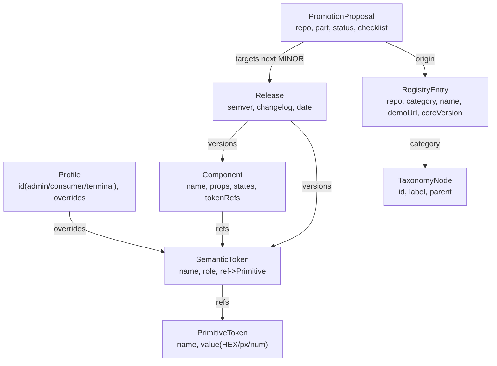

# U1 Core DS — Domain Entities

> Core DS のドメインモデル（技術非依存）。

## エンティティ関係図

## エンティティ定義
| Entity | 主要属性 | 制約 |
|---|---|---|
| **PrimitiveToken** | `name(--fig-*)`, `value` | 最下層・依存なし |
| **SemanticToken** | `name`, `role`, `ref→Primitive` | Primitive のみ参照（BR-1） |
| **Profile** | `id(admin/consumer/terminal)`, `overrides[]` | Semantic を上書き（全種, FDQ2=A） |
| **Component** | `name`, `props`, `states[]`, `tokenRefs[]`, `previewUrl`, `a11y` | Semantic のみ参照／フル契約（BR-8） |
| **Release** | `semver`, `changelog`, `date` | MINOR=昇格/追加, MAJOR=破壊（BR-5） |
| **RegistryEntry** | `repo`, `category`, `subcategory`, `name`, `demoUrl`, `coreVersion` | category∈taxonomy（BR-6）／命名規約 |
| **TaxonomyNode** | `id`, `label`, `parent` | カテゴリ＞サブカテゴリ＞プロジェクト |
| **PromotionProposal** | `repo`, `part`, `status(proposed/promoted)`, `checklist` | 昇格判定 BR-4 |

## 集約・正典の所在
- **Core DS が正典**: PrimitiveToken / SemanticToken / Profile / Component / Release / **RegistryEntry / TaxonomyNode**（FQ1=A）
- ポータルは RegistryEntry/TaxonomyNode を rolling 読取（書込不可）
- PromotionProposal は Issue/PR として表現（`core-promotion` ラベル）
