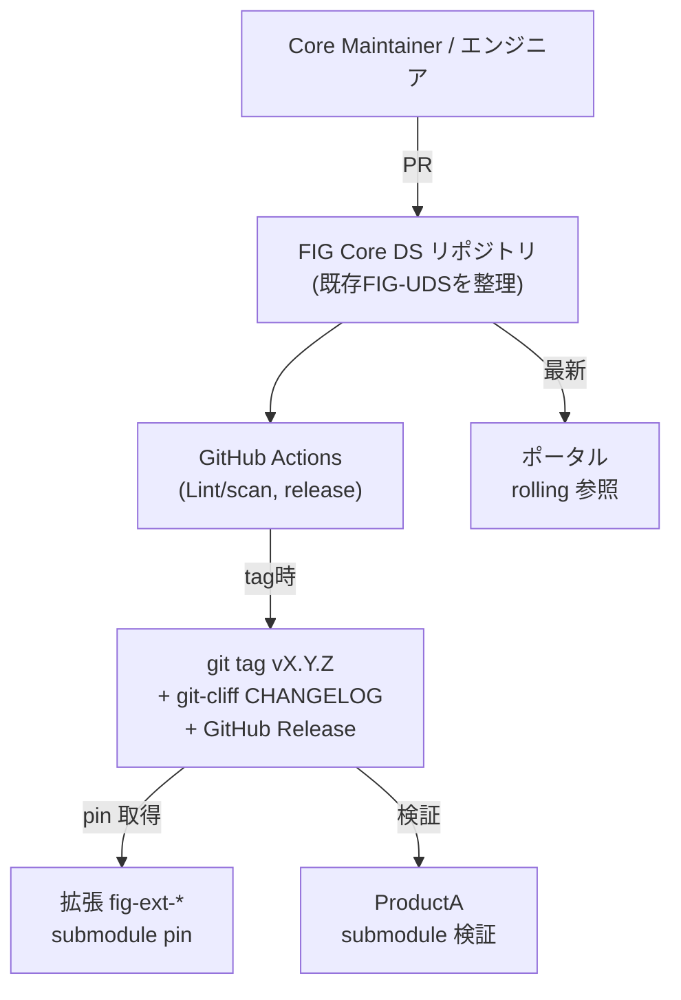

# U1 Core DS — Deployment Architecture

> 「デプロイ」＝ git タグの発行と配布。サーバ/ランタイムなし。

## 配置アーキ図

## リリースフロー
1. PR マージ（Contribution ルール準拠、Lint/scan グリーン）
2. リリース対象を SemVer タグ付け
3. GitHub Actions が git-cliff で CHANGELOG 生成＋GitHub Release 作成
4. 配布:
   - 拡張: 次回 `git submodule update` ＋ `CORE-DS-VERSION` 更新で取得（明示）
   - ポータル: rolling で最新反映（VRT グリーンが条件, U2/U5）

## 環境
| 項目 | 値 |
|---|---|
| ホスティング | GitHub（`takahashiman/`） |
| ランタイム | なし（source 配布） |
| デプロイ対象 | git tag / GitHub Release |
| Pages | 不要（U2 ポータルが使用） |

## 非対象（N/A）
- サーバ/コンテナ/サーバレス、DB、キュー、LB、VPC、オートスケール
