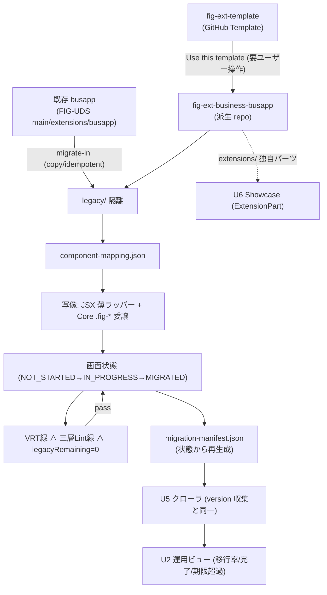

# U4 Migration — Deployment Architecture

> 確定: IDQ1-6 = すべて A。「取り込み → 画面移行 → 完了判定 → 進捗集約」の全体フロー・環境・トリガ・冪等/ロールバック。

## 1. 全体フロー（取り込み〜完了〜集約）


## 2. 取り込み Runbook（migrate-in 拡張・冪等）
U3 SetupRunbook に migrate-in / baseline を挿入した順序:
| 順 | ステップ | 環境 | 冪等 |
|---|---|---|---|
| 1 | derive | ローカル/CI | busapp 既存 project-settings の不足補完 |
| 2 | duplicate | GitHub（要ユーザー操作） | Template 派生 |
| 3 | **migrate-in** | ローカル/CI | 取り込み元→`legacy/`（ハッシュ突合で二重防止） |
| 4 | apply | ローカル/CI | signature/profile/版/表示名適用 |
| 5 | pin | ローカル/CI | Core submodule pin＋CORE-DS-VERSION |
| 6 | wire-ci | ローカル/CI | U5 参照の workflow 配線（SHA pin） |
| 7 | register | Actions/`gh` | registry 登録 PR（CI-5＋Maintainer） |
| 8 | **baseline** | ローカル/CI | 全画面棚卸し・critical flows 宣言・manifest 初期化 |
| 9 | verify | ローカル/CI | 必須値/pin/CI/registry/manifest の存在検証 |

## 3. 画面移行ループ（運用）
```
for each screen (critical flows 優先):
    1. 画面内の全部品を component-mapping に従い Core 化（部分置換で止めない）
    2. preview スナップショット取得
    3. CI: 三層 Lint + VRT (baseline=legacy preview)
    4. green かつ legacyRemaining==0 → state=MIGRATED
    5. manifest 再生成（overallRatio/criticalDone 更新）
    repeat until: criticalDone ∧ overallRatio>=0.80 → 移行完了
post-completion: 製品ラッパー撤去・legacy/ 空を verify
```

## 4. トリガ
| トリガ | 動作 |
|---|---|
| push / PR（製品 repo） | 三層 Lint＋VRT＋混在検出＋manifest 再生成＋ラッパー期限 Lint |
| ポータルビルド / nightly（U5） | manifest 収集→運用ビュー集約（version-matrix と統合） |
| Core release（repository_dispatch） | pin 更新検討・MAJOR 時は MigrationGuide 参照を完了必須項目に |
| 手動（workflow_dispatch） | 移行率レポート・dry-run 取り込み |

## 5. 環境
| 環境 | 用途 |
|---|---|
| ローカル Node | migrate-in / apply / manifest 生成 / dry-run |
| GitHub Actions（ubuntu+Node LTS） | Lint/VRT/収集/registry PR。Actions SHA pin |
| GitHub（repo/Template/submodule） | repo 確立・Core 配布・registry |

## 6. 冪等性 / ロールバック
- **冪等**: migrate-in（ハッシュ突合）・apply・manifest 生成は再実行で壊れない（REL-1/5）。
- **ロールバック**: `legacy/` 隔離＋git で画面/部品単位に旧実装へ復帰可。完了前は新旧画面間併存を期限内許容（BR-SCR-3）。VRT 赤は `MIGRATED` を差し戻し。
- **fail-stop**: 各ステップ失敗は停止・理由提示（部分適用放置なし / REL-3）。

## 7. 要ユーザー操作（再掲）
1. GitHub 上で `fig-ext-template` から `fig-ext-business-busapp` を Template 派生作成。
2. Core submodule 配線・pin（CORE-DS-VERSION 整合）。
3. migrate-in の取り込み元参照（FIG-UDS main/extensions/busapp）設定。
4. registry PR 用最小権限トークン/GitHub App 設定。
5. U5 共有 Lint/VRT/収集の SHA 配線。
6. taxonomy category（business 等）の Maintainer 承認。
