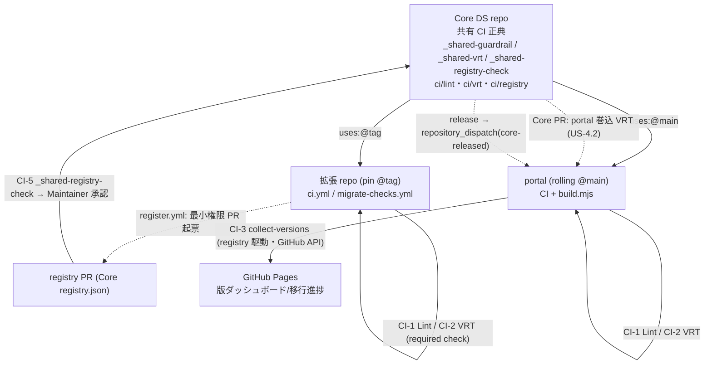

# U5 CI/CD Automation — Deployment Architecture

> 確定: IDQ1-8 = すべて A。「PR ゲート（Lint/VRT）→ merge」「portal build → 収集 → Pages 反映」「registry PR → 検査 → Maintainer 承認」の全体フロー・トリガ・スタブ実体化マップ。

## 1. 全体フロー（共有 CI 正典 → 各 repo の required check）


## 2. PR ゲート（CI-1 Lint / CI-2 VRT）
```
PR (拡張 repo / portal):
  job guardrail: uses Core/_shared-guardrail.yml@<ref>
     → three-layer-lint (CSS+JSX/HTML, LintRuleSet)
     → LintViolation>0 ? required check ❌ : ✅
  job vrt: uses Core/_shared-vrt.yml@<ref>
     → render changed previews (Playwright) → diff vs preview/__baseline__/
     → diffRatio>threshold ? required check ❌ (差分 artifact+PR コメント) : ✅
  merge 可 = 全 required check ✅
```

## 3. Core 変更 → portal 巻込 VRT（US-4.2 AC1）
```
Core PR:
  job portal-vrt: uses (Core 内) _shared-vrt.yml [mode=core-to-portal]
     1. checkout Core(PR head) + portal(read-only)
     2. portal の Core 参照を PR head に vendor 取込 (rolling 相当)
     3. portal U2 build → preview
     4. VRT(portal preview vs portal baseline)
     5. 差分許容外 → Core PR の required check ❌ (Core をマージ不可)
```

## 4. version / migration 収集（CI-3 / portal build）
```
trigger: push(portal) | repository_dispatch(core-released) | nightly | workflow_dispatch
collect-versions.mjs:
  registry ← Core registry.json (GitHub API)
  latest   ← Core 最新 SemVer タグ (API tags)
  for proj in registry.entries (並列):
     pin ← GitHub API contents (submodule→CORE-DS-VERSION→package.json)
     status ← compare(pin, latest)
     manifest ← GitHub API contents (migration/migration-manifest.json) [任意]
  write data/version-matrix.json (U2 schema) + data/migration-index.json
  fail-soft: 個別失敗=unknown/skip, 全体失敗=直近据え置き
→ portal build → GitHub Pages (版ダッシュボード/移行進捗)
```

## 5. registry 登録 PR → 検査 → 承認（CI-5）
```
製品 register.yml (最小権限 token/App):
  build registry-entry from project-settings → Core registry.json への PR 起票 (直接 push 禁止)
Core _shared-registry-check.yml (PR トリガ):
  C1 schema / C2 taxonomy / C3 naming / C4 dup / C5 coreVersion-exists
  全 pass → required ✅ (ただし自動マージ禁止)
  Maintainer 承認 → merge → registry 正典更新 → 次回 collect で版ダッシュボードに反映
```

## 6. トリガ一覧
| トリガ | 動作 |
|---|---|
| push / PR（拡張 repo・portal） | CI-1 三層 Lint＋CI-2 VRT（required check） |
| Core PR | _shared-guardrail（Core 自身）＋ portal 巻込 VRT（US-4.2） |
| registry PR | CI-5 _shared-registry-check → Maintainer 承認 |
| portal push / nightly / 手動 | CI-3 collect-versions（version+migration 集約）→ Pages |
| Core release → repository_dispatch(core-released) | portal rolling 再ビルド・再収集（最新版反映） |

## 7. 環境
| 環境 | 用途 |
|---|---|
| GitHub Actions（ubuntu + Node LTS） | Lint/VRT/収集/registry 検査。Actions SHA pin・依存/ブラウザ cache |
| GitHub API（contents/tags） | pin・manifest・最新タグ取得（チェックアウト不要） |
| GitHub Pages（U2） | 収集結果の表示（版ダッシュボード/移行進捗） |
| ローカル Node | collect-versions / Lint のローカル実行（dev） |

## 8. スタブ実体化マップ（U5 が回収する配線点）
| 既存スタブ | 実体化後 |
|---|---|
| `fig-ext-template/.github/workflows/ci.yml`（Lint/VRT echo） | `uses: Core/_shared-guardrail.yml@<ref>` ＋ `_shared-vrt.yml@<ref>` |
| `fig-ext-business-busapp/.github/workflows/migrate-checks.yml`（Lint/VRT notice） | 同 reusable workflow 参照（migration-status は U4 のまま） |
| `fig-ext-template/.github/workflows/register.yml`（検査委譲） | 起票後 Core `_shared-registry-check.yml` がゲート |
| `portal/scripts/build.mjs`（version-matrix/showcase スタブ生成） | `collect-versions.mjs` 実体収集を呼出（showcase は U6） |
| Core repo（lint 設定ファイル無し） | `.github/workflows/_shared-*.yml`・`.github/actions/`・`ci/` 新設 |

## 9. 信頼性 / 再現性
- **再現性**: Actions SHA pin＋ツール版固定で過去 commit 再実行も同一（REL-1）。
- **fail-soft 収集**: 個別 repo 失敗は unknown/skip、全体失敗は据え置き（REL-3/4）。portal ビルドを止めない。
- **ゲートの確実性**: Lint/VRT/registry は required status check として branch protection でマージブロック（要ユーザー操作で有効化）。

## 10. 要ユーザー操作（GitHub 側・user-actions-checklist フェーズ E）
1. Core repo に共有 CI をマージし参照用 SemVer タグ発行。
2. 各 repo の `uses:` を実 org/repo・`@<ref>`（拡張=pin / portal=main）へ設定。
3. branch protection で Lint/VRT/registry-check を **required status checks** 化。
4. registry PR 用 最小権限トークン/GitHub App 設定（Core・各製品）。
5. portal 収集トリガ（push / repository_dispatch / nightly）配線・GitHub API read token 設定。
6. Core release → portal `repository_dispatch(core-released)` 送出（rolling 自動追従）。
