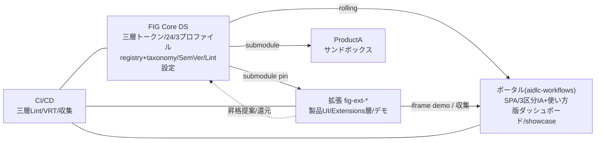

# Application Design（統合） — FIG デザインシステム循環システム

> [components.md] / [component-methods.md] / [services.md] / [component-dependency.md] を統合した設計サマリ。
> 詳細ビジネスロジックは Construction の Functional Design（per-unit）。

## 設計確定事項（ADQ1-6 + FQ1）
| 項目 | 決定 |
|---|---|
| ポータル実装（ADQ1） | **vanilla JS SPA 踏襲**（既存 `portal-content.js` 拡張、ハッシュルーター） |
| デモ統合（ADQ2） | **iframe 埋め込み**（各拡張がビルド済みプレビューを公開、ポータルが集約） |
| repo 発見（ADQ3） | **中央 `registry.json`** ＋ **新規セットアップ時に AI が登録 PR を自動起票** |
| taxonomy（ADQ4/FQ1） | **`taxonomy.json`** を **`registry.json` と共に Core DS に集約**（単一正典・Core Maintainer 管理） |
| 命名規約（ADQ5） | **`fig-ext-<category>-<product>`** |
| 配布（ADQ6） | **git submodule**（拡張は pin＋`CORE-DS-VERSION`、ポータルは rolling） |

## アーキテクチャ全体像

## コンポーネント群（要約）
- **Core DS**: CD-1 Primitive / CD-2 Semantic / CD-3 Profile / CD-4 Components(24) / CD-5 Metadata(registry+taxonomy) / CD-6 Versioning / CD-7 Lint設定 / CD-8 昇格資産
- **ポータル**: PT-1 Shell/Router / PT-2 SideNav / PT-3 IA / PT-4 ProjectView(iframe) / PT-5 VersionDashboard / PT-6 Showcase / PT-7 MetadataReader / PT-8 UsageGuide
- **Template/Setup**: TM-1 Template / TM-2 PromptGenerator / TM-3 AISetup(+登録PR)
- **CI/CD**: CI-1 Lint / CI-2 VRT / CI-3 VersionCollector / CI-4 ShowcaseCollector / CI-5 RegistrationCheck
- **拡張**: EX-1 ProductUI / EX-2 Extensions層 / EX-3 VersionPin / EX-4 DemoPublish
- **Sandbox**: SB-1 ProductA

## サービス（オーケストレーション）
- SV-1 Portal Build / SV-2 New Project Setup / SV-3 Core Promotion / SV-4 Migration / SV-5 Guardrail CI / SV-6 Metadata Governance

## 主要設計原則
1. **三層アーキテクチャ**：上位は下位のみ参照（CI-1 で強制）
2. **rolling vs pin**：ポータル＝最新／拡張＝固定（VRT で rolling を保護）
3. **スコープ分離**：マルチレポ。開発/AI には Core＋対象製品のみ
4. **単一正典メタデータ**：registry/taxonomy は Core DS（FQ1=A）
5. **登録の構造的強制**：セットアップ時 auto-PR（ADQ3）で漏れ防止
6. **操作随伴ガイド＋玄人最適化IA**：全操作に再現可能手順、詳細は別ページ

## 構築フェーズ対応（execution-plan）
① Core DS（CD-*）→ ② ポータル（PT-*）→ ③ template/取込（TM-*, EX-*, SV-2/4）→ ④ CI/CD（CI-*, SV-5）→ ⑤ showcase（CI-4, PT-6）。横断: SB-1。

## 未確定（Construction で詳細化）
- 各 UI コンポーネントの詳細 Props/状態（Functional Design・Core DS spec.md）
- VRT/HTML 差分可視化の具体ツール（NFR/Infra Design）
- Lint ルールの具体実装（NFR Design）
