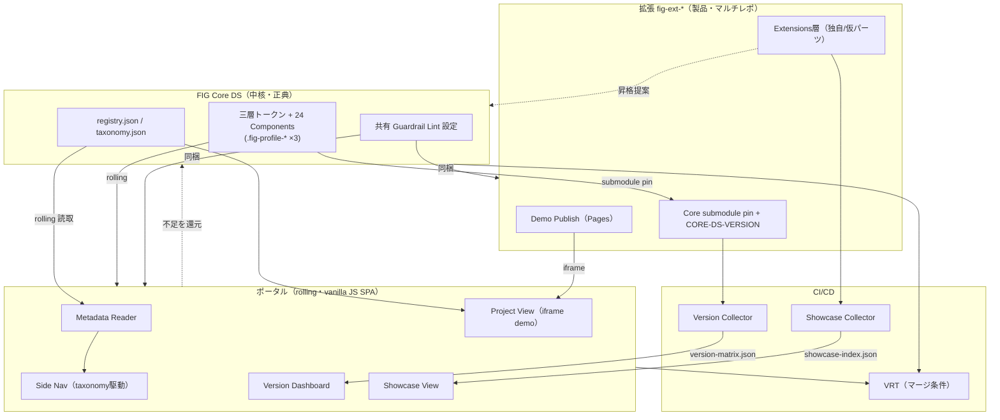

# Component Dependencies — Application Design

## 依存マトリクス（← が「依存する」）
| コンポーネント | 依存先 | 種別 | 理由 |
|---|---|---|---|
| CD-2 Semantic | CD-1 Primitive | 参照 | 三層（下層のみ参照） |
| CD-3 Profile | CD-2 Semantic | 上書き | プロファイル別トークン |
| CD-4 Components | CD-2 Semantic | 参照 | Component は Semantic のみ |
| EX-1 Product UI | CD-4（submodule pin） | 配布 | 製品が Core を pin |
| EX-4 Demo Publish | EX-1 | ビルド | iframe 用プレビュー |
| PT-7 Metadata Reader | CD-5（rolling） | 読取 | taxonomy/registry 正典 |
| PT-2 Side Nav | PT-7 / CD-5 | データ | taxonomy 駆動 |
| PT-4 Project View | CD-5 registry, EX-4 | iframe | デモ集約 |
| PT-5 Version Dashboard | CI-3 出力 | データ | version-matrix.json |
| PT-6 Showcase View | CI-4 出力 | データ | showcase-index.json |
| CI-3 Version Collector | CD-5 registry, EX-3 | 収集 | 各 repo の pin |
| CI-4 Showcase Collector | CD-5 registry, EX-2 | 収集 | 独自/仮パーツ |
| CI-1 Lint | CD-7 共有設定 | 設定 | 三層強制 |
| CI-2 VRT | PT-*（ポータル）, CD-*（Core） | 検証 | rolling 崩れ検知 |
| TM-3 AI Setup | TM-1, TM-2, CD-5 registry | 生成 | 複製＋登録PR |
| SB-1 ProductA | CD-4（submodule） | 検証 | 引込み確認 |

## クリティカルパス
**FIG Core DS（CD-*）** が全依存の根。Core の変更は rolling 経由でポータルへ即時、pin 経由で拡張へ選択的に波及。

## データフロー図

## 通信パターン
- **Core → 拡張**: git submodule（pin、明示更新）
- **Core → ポータル**: rolling（最新を常時反映）＋ VRT で保護
- **拡張 → ポータル**: iframe（デモ）＋ CI 収集（版/showcase）
- **拡張/ポータル → Core**: 昇格提案（Issue/PR）・registry 自動 PR・不足還元
- **メタデータ**: registry/taxonomy は Core DS が単一正典（FQ1=A）、ポータルは読取専用
