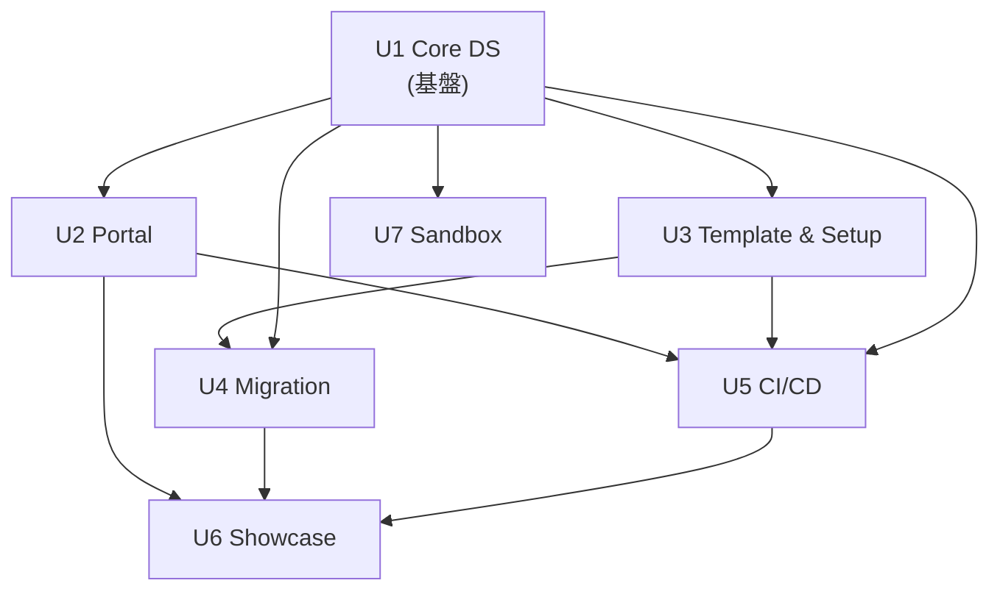

# Unit of Work — Dependency & Update Order

## 依存マトリクス（← が依存）
| Unit | 依存先 | 理由 |
|---|---|---|
| U1 Core DS | （なし・基盤） | 全 Unit の親 |
| U2 Portal | U1 | rolling 参照、registry/taxonomy 読取 |
| U3 Template & Setup | U1 | template が Core を pin、registry へ PR |
| U4 Migration | U1, U3 | Core pin、template/セットアップ流用 |
| U5 CI/CD | U1（Lint設定）, U2, U3 | 各 repo の workflow、VRT は U1×U2 |
| U6 Showcase | U2, U4（収集対象）, U5（collector基盤） | 拡張のパーツを収集しポータルに表示 |
| U7 Sandbox | U1 | submodule 検証 |

## 更新順序（クリティカルパス＝U1）

## 並行可否
- **逐次必須**: U1 を最初に（全依存の根）
- **並行可**: U1 後、**U2 と U3 は並行可**。U7 は U1 後いつでも
- **後続**: U4（U1+U3後）→ U5（U1+U2+U3後）→ U6（U2+U4+U5後）

## コーディネーション・ポイント
- **Core 版契約**: U1 の SemVer（U3/U4 は pin、U2 は rolling）
- **共有 Lint 設定**: U1 → U3/U2/各 repo へ同梱（U5 が実行）
- **メタデータ正典**: U1 の registry/taxonomy（U2 が読取、U3 が PR 追記）
- **VRT ベースライン**: U1 変更 × U2 ポータル（U5 がマージ条件化）

## ロールバック戦略
- git ベース。U1 は SemVer 固定で拡張影響を局所化（pin）。ポータルは rolling だが VRT グリーンを条件に前進
