# Execution Plan — FIG デザインシステム循環システム

## Detailed Analysis Summary

### Transformation Scope (Brownfield)
- **Transformation Type**: Architectural（マルチレポ再編＋新規構築）
- **Primary Changes**: FIG Core DS の正典化＋ SemVer 化／cloudscape 風ポータル新設／template 化＋既存取り込み導線／CI-CD 自動化／showcase
- **Related Components**: Core DS / 拡張プロジェクト（template・各製品）/ ポータル（aidlc-workflows）/ サンドボックス（ProductA）

### Change Impact Assessment
- **User-facing changes**: Yes — ポータル UI（閲覧・ナビ・デモ・使い方）、開発者体験（template 派生・AI セットアップ）
- **Structural changes**: Yes — マルチレポ構成、三層アーキ、submodule 配布、2系列/二重ネストの解消
- **Data model changes**: Yes（広義）— トークン階層、taxonomy 構造、`CORE-DS-VERSION`／バージョン収集マニフェスト、showcase インデックス
- **API changes**: No（REST/外部API なし。コンポーネント Props 契約は spec で管理）
- **NFR impact**: Yes — WCAG 2.1 AA、Security Baseline、VRT、三層 Lint、rolling 安定性

### Component Relationships
- **Primary Component**: FIG Core DS（全拡張・ポータルの親）
- **Dependent Components**: 拡張プロジェクト（Core を pin）、ポータル（Core を rolling 参照）、サンドボックス（Core を submodule 検証）
- **Supporting Components**: CI/CD（三層 Lint・VRT・バージョン収集）、Interactive Prompt Generator（template セットアップ）

### Risk Assessment
- **Risk Level**: **High**（アーキテクチャ再編・マルチレポ・ガバナンス導入）
- **Rollback Complexity**: Moderate（git ベースで可逆。submodule/版整合とブランチ統合に注意）
- **Testing Complexity**: Moderate（VRT＋三層 Lint＋移行チェックリストで自動化）

## Workflow Visualization

```mermaid
flowchart TD
    Start(["User Request"])

    subgraph INCEPTION["🔵 INCEPTION PHASE"]
        WD["Workspace Detection<br/><b>COMPLETED</b>"]
        RE["Reverse Engineering<br/><b>COMPLETED</b>"]
        RA["Requirements Analysis<br/><b>COMPLETED</b>"]
        US["User Stories<br/><b>COMPLETED</b>"]
        WP["Workflow Planning<br/><b>IN PROGRESS</b>"]
        AD["Application Design<br/><b>EXECUTE</b>"]
        UG["Units Generation<br/><b>EXECUTE</b>"]
    end

    subgraph CONSTRUCTION["🟢 CONSTRUCTION PHASE"]
        FD["Functional Design<br/><b>EXECUTE</b>"]
        NFRA["NFR Requirements<br/><b>EXECUTE</b>"]
        NFRD["NFR Design<br/><b>EXECUTE</b>"]
        ID["Infrastructure Design<br/><b>EXECUTE</b>"]
        CG["Code Generation<br/><b>EXECUTE</b>"]
        BT["Build and Test<br/><b>EXECUTE</b>"]
    end

    subgraph OPERATIONS["🟡 OPERATIONS PHASE"]
        OPS["Operations<br/><b>PLACEHOLDER</b>"]
    end

    Start --> WD
    WD --> RE
    RE --> RA
    RA --> US
    US --> WP
    WP --> AD
    AD --> UG
    UG --> FD
    FD --> NFRA
    NFRA --> NFRD
    NFRD --> ID
    ID --> CG
    CG --> BT
    BT --> OPS
    OPS --> End(["Complete"])

    style WD fill:#4CAF50,stroke:#1B5E20,stroke-width:3px,color:#fff
    style RE fill:#4CAF50,stroke:#1B5E20,stroke-width:3px,color:#fff
    style RA fill:#4CAF50,stroke:#1B5E20,stroke-width:3px,color:#fff
    style US fill:#4CAF50,stroke:#1B5E20,stroke-width:3px,color:#fff
    style WP fill:#FFA726,stroke:#E65100,stroke-width:3px,color:#000
    style AD fill:#FFA726,stroke:#E65100,stroke-width:3px,stroke-dasharray: 5 5,color:#000
    style UG fill:#FFA726,stroke:#E65100,stroke-width:3px,stroke-dasharray: 5 5,color:#000
    style FD fill:#FFA726,stroke:#E65100,stroke-width:3px,stroke-dasharray: 5 5,color:#000
    style NFRA fill:#FFA726,stroke:#E65100,stroke-width:3px,stroke-dasharray: 5 5,color:#000
    style NFRD fill:#FFA726,stroke:#E65100,stroke-width:3px,stroke-dasharray: 5 5,color:#000
    style ID fill:#FFA726,stroke:#E65100,stroke-width:3px,stroke-dasharray: 5 5,color:#000
    style CG fill:#4CAF50,stroke:#1B5E20,stroke-width:3px,color:#fff
    style BT fill:#4CAF50,stroke:#1B5E20,stroke-width:3px,color:#fff
    style OPS fill:#BDBDBD,stroke:#424242,stroke-width:2px,stroke-dasharray: 5 5,color:#000
    style Start fill:#CE93D8,stroke:#6A1B9A,stroke-width:3px,color:#000
    style End fill:#CE93D8,stroke:#6A1B9A,stroke-width:3px,color:#000

    linkStyle default stroke:#333,stroke-width:2px
```

## Phases to Execute

### 🔵 INCEPTION PHASE
- [x] Workspace Detection (COMPLETED)
- [x] Reverse Engineering (COMPLETED)
- [x] Requirements Analysis (COMPLETED)
- [x] User Stories (COMPLETED)
- [x] Workflow Planning (IN PROGRESS)
- [ ] Application Design - **EXECUTE**
  - **Rationale**: 新規コンポーネント/サービス多数（Core DS・ポータルアプリ・template・CI/CD・showcase・バージョンダッシュボード）。三層アーキ、マルチレポ構成、依存（rolling/pin）、taxonomy データ構造の設計が必要
- [ ] Units Generation - **EXECUTE**
  - **Rationale**: 複数リポジトリ/パッケージへ分解（Core DS・ポータル・template・CI/CD・showcase・サンドボックス）。構築フェーズ①〜⑤が自然な Unit 境界

### 🟢 CONSTRUCTION PHASE
- [ ] Functional Design - **EXECUTE**（Unit ごとに適応的）
  - **Rationale**: トークン階層・コンポーネント契約・taxonomy/バージョン/ショーケースのデータ構造・昇格/移行ロジックの設計が必要（純 CSS トークン Unit は軽め）
- [ ] NFR Requirements - **EXECUTE**
  - **Rationale**: WCAG 2.1 AA、Security Baseline（有効）、VRT/性能（rolling 安定）、三層 Lint の品質要件
- [ ] NFR Design - **EXECUTE**
  - **Rationale**: a11y パターン、セキュリティヘッダ/SRI/サプライチェーン、VRT・Lint・バージョン収集の設計
- [ ] Infrastructure Design - **EXECUTE**（GitHub 中心・軽量）
  - **Rationale**: GitHub Pages 公開、GitHub Actions（CI/CD・VRT・バージョン収集）、Template Repository、submodule 配布、マルチレポ topology
- [ ] Code Generation - **EXECUTE (ALWAYS)**
  - **Rationale**: 各 Unit の実装・テスト生成
- [ ] Build and Test - **EXECUTE (ALWAYS)**
  - **Rationale**: ビルド・テスト・VRT 検証

### 🟡 OPERATIONS PHASE
- [ ] Operations - **PLACEHOLDER**
  - **Rationale**: 将来のデプロイ運用・監視（AI-DLC プレースホルダ）

> 注: スキップするステージはありません（複合システムのため全ステージ EXECUTE）。

## Package / Module Update Sequence（Multi-Repo）
- **Update Approach**: Hybrid（Core 先行 → 以降は一部並行）
- **Critical Path**: **FIG Core DS**（全依存の親）
- **Coordination Points**: Core の SemVer 版（拡張は pin / ポータルは rolling）、submodule 配布、`.fig-profile-*` プロファイル契約、三層トークン

| 順 | Unit（フェーズ） | 依存 | 並行可否 | 変更スコープ |
|---|---|---|---|---|
| 1 | **① Core DS 整備** | なし（基盤） | — | Major（正典化・SemVer 化・2系列/二重ネスト解消） |
| 2 | **② ポータル** | ① | ③と一部並行可 | Major（新設） |
| 3 | **③ template＋既存取り込み** | ① | ②と一部並行可 | Major（template 化・取り込み導線） |
| 4 | **④ CI/CD 自動化** | ①②③ | — | Minor（Lint/VRT/バージョン収集） |
| 5 | **⑤ showcase** | ②③ | — | Minor（自動クローリング・展示） |
| ※ | **横断: サンドボックス検証(ProductA)** | ① | 随時 | 検証後削除 |

- **Testing Strategy**: Unit ごとに三層 Lint＋（②以降）VRT。統合は②⑤完成後にポータルで通し確認
- **Rollback Strategy**: git ベース。Core の版固定（拡張は pin）で影響を局所化

## Estimated Timeline
- **Total Stages（残）**: Inception 2（AD/UG）＋ Construction 6（per-unit×5 + Build&Test）
- **Estimated Duration**: 概算 — Inception 残 1〜2 セッション、Construction は Unit×5 を順次（各 Unit 1〜2 セッション）。※自動化前提で短縮見込み

## Success Criteria
- **Primary Goal**: FIG Core DS を恒久中核とする「設計→拡張→蓄積→再生産」の循環を、ポータル・template・CI/CD・ガバナンスとともに稼働状態にする
- **Key Deliverables**: Core DS(24/3プロファイル/SemVer)・cloudscape 風ポータル(3区分IA/rolling/taxonomy/showcase/版ダッシュボード/Pages)・template＋AI 自律セットアップ・CI/CD(三層Lint/VRT/版収集)・Core昇格/移行ガバナンス・操作随伴ガイド
- **Quality Gates**: 三層 Lint グリーン／VRT グリーン（マージ条件）／WCAG 2.1 AA／Security Baseline 適用ルール充足／移行チェックリスト○
- **Integration Testing**: ポータルで Core＋拡張＋showcase＋版ダッシュボードが統合表示
- **Operational Readiness**: Core昇格フロー・二段レビュー・バージョン自動収集が運用可能
