# Execution Plan — イニシアチブ#2（実開発 dogfooding ＋ ポータル綿密化）

> 入力: RE改訂（busdelayalerts-delta-analysis）/ initiative2-requirements / initiative2-stories / initiative2-personas。
> 前サイクル `execution-plan.md` は正典として保全。本書は#2 の段階決定。

## Detailed Analysis Summary

### Transformation Scope（Brownfield）
- **Transformation Type**: Application changes（既存実アプリのスタイル整理）＋ Content/IA changes（ポータル）＋ Cross-repo（Core 昇格）。
- **Primary Changes**:
  - BusDelayAlerts(LLocana): 古い内蔵 DS → FIG-UDS フローへ置換／整理（配布・@theme ブリッジ・signature・状態色・生 HEX 解消・プロファイル）。
  - aidlc-workflows ポータル: §4-4 IA（役割別入口・2シナリオ別フロー・getting-started 責務分離・オンボ・閲覧余白・GitHub 操作案内）。
  - FIG-UDS Core: ドメインパターンの昇格（実行・S4=B）。
  - UX: VSCode×Pencil による画面遷移/UX 改修フロー確立（S3=C）。
- **Related Components**: Core DS（submodule・rolling）／ポータル build/IA（portal-content.js は Core 側正典）／CI 三層ガードレール／registry/version 収集。

### Change Impact Assessment
- **User-facing changes**: Yes（開発者の dogfooding 操作・閲覧者のポータル導線・UX 改修）。
- **Structural changes**: Partial（アプリにトークンブリッジ層・配布 submodule を追加。アプリ大構造は保持＝既存非回帰）。
- **Data model changes**: No（モックデータ中心・スキーマ変更なし）。registry/taxonomy に LLocana 表示追加はあり得る。
- **API changes**: No（外部 API 契約なし。ポータル収集は既存トークン権限内）。
- **NFR impact**: Yes（Security Baseline 有効・a11y AA・既存非回帰・三層ガードレール・ポータル性能）。

### Component Relationships（Brownfield）
- **Primary**: BusDelayAlerts(LLocana)（Vite/React/Tailwind v4）/ aidlc-workflows ポータル。
- **Shared/Upstream**: FIG-UDS Core DS（submodule pin・rolling 取込／昇格先）。
- **Dependent**: ポータルの版ダッシュボード・showcase（rolling で LLocana を反映し得る）。
- **Supporting**: CI 三層ガードレール・registry/version 収集・GitHub Pages。

### Risk Assessment
- **Risk Level**: Medium（複数 repo 横断だが大半は加法的・スタイル整理。ロールバックはブランチ単位で容易）。
  - 相対的に高いのは **Core 昇格（正典 repo への変更・US-X1）** と **配布の Vite 互換（US-D1）**＝先に PoC/検証で潰す。
- **Rollback Complexity**: Easy〜Moderate（before=`feature/home-redesign` 温存・作業=`feature/figuds-adoption`）。
- **Testing Complexity**: Moderate（`vite build` 非回帰・三層 Lint・ポータル build/test・セルフ検証チェックリスト）。

## Workflow Visualization

```mermaid
flowchart TD
    Start(["イニシアチブ#2 要求"])

    subgraph INCEPTION["INCEPTION PHASE"]
        WD["Workspace Detection<br/><b>COMPLETED</b>"]
        RE["Reverse Engineering 差分<br/><b>COMPLETED</b>"]
        RA["Requirements Analysis<br/><b>COMPLETED</b>"]
        US["User Stories<br/><b>COMPLETED</b>"]
        WP["Workflow Planning<br/><b>IN PROGRESS</b>"]
        AD["Application Design<br/><b>EXECUTE</b>"]
        UG["Units Generation<br/><b>EXECUTE</b>"]
    end

    subgraph CONSTRUCTION["CONSTRUCTION PHASE (per-unit)"]
        FD["Functional Design<br/><b>EXECUTE 条件付</b>"]
        NFRA["NFR Requirements<br/><b>EXECUTE 条件付</b>"]
        NFRD["NFR Design<br/><b>EXECUTE 条件付</b>"]
        ID["Infrastructure Design<br/><b>EXECUTE 条件付</b>"]
        CG["Code Generation<br/><b>EXECUTE</b>"]
        BT["Build and Test<br/><b>EXECUTE</b>"]
    end

    subgraph OPERATIONS["OPERATIONS PHASE"]
        OPS["Operations<br/><b>PLACEHOLDER</b>"]
    end

    Start --> WD --> RE --> RA --> US --> WP --> AD --> UG
    UG --> FD --> NFRA --> NFRD --> ID --> CG --> BT --> OPS
    OPS --> End(["完了"])

    style WD fill:#4CAF50,stroke:#1B5E20,stroke-width:3px,color:#fff
    style RE fill:#4CAF50,stroke:#1B5E20,stroke-width:3px,color:#fff
    style RA fill:#4CAF50,stroke:#1B5E20,stroke-width:3px,color:#fff
    style US fill:#4CAF50,stroke:#1B5E20,stroke-width:3px,color:#fff
    style WP fill:#FFA726,stroke:#E65100,stroke-width:3px,color:#000
    style AD fill:#FFA726,stroke:#E65100,stroke-width:3px,stroke-dasharray: 5 5,color:#000
    style UG fill:#FFA726,stroke:#E65100,stroke-width:3px,stroke-dasharray: 5 5,color:#000
    style FD fill:#FFA726,stroke:#E65100,stroke-width:3px,stroke-dasharray: 5 5,color:#000
    style NFRA fill:#FFA726,stroke:#E65100,stroke-width:3px,stroke-dasharray: 5 5,color:#000
    style NFRD fill:#FFA726,stroke:#E65100,stroke-width:3px,stroke-dasharray: 5 5,color:#000
    style ID fill:#FFA726,stroke:#E65100,stroke-width:3px,stroke-dasharray: 5 5,color:#000
    style CG fill:#4CAF50,stroke:#1B5E20,stroke-width:3px,color:#fff
    style BT fill:#4CAF50,stroke:#1B5E20,stroke-width:3px,color:#fff
    style OPS fill:#FFF59D,stroke:#F9A825,stroke-width:2px,color:#000
    style Start fill:#CE93D8,stroke:#6A1B9A,stroke-width:3px,color:#000
    style End fill:#CE93D8,stroke:#6A1B9A,stroke-width:3px,color:#000
    linkStyle default stroke:#333,stroke-width:2px
```

## Phases to Execute

### 🔵 INCEPTION PHASE
- [x] Workspace Detection (COMPLETED)
- [x] Reverse Engineering 差分 (COMPLETED)
- [x] Requirements Analysis (COMPLETED)
- [x] User Stories (COMPLETED)
- [x] Workflow Planning (IN PROGRESS)
- [ ] Application Design — **EXECUTE**（ユーザー判断 2026-06-20: SKIP→含める）
  - **Rationale**: #2 の新規結線（**@theme トークンブリッジ層**・signature 注入・ポータル IA 新ビュー・**Core 昇格パイプライン**・Pencil 連携）の**コンポーネント境界・I/F・repo 跨ぎ依存を、Unit 分解の前に1枚の青写真**として固める。特に新規性/横断性の高い「@theme ブリッジ層」「Core 昇格パイプライン」を先に設計。詳細ビジネスロジックは各 Unit の Functional Design へ委譲。
- [ ] Units Generation — **EXECUTE**
  - **Rationale**: 複数 repo（BusDelayAlerts／ポータル／Core）に跨る独立性のある作業を Unit へ分解する必要（dogfooding／ポータル IA／Core 昇格／UX 改修）。

### 🟢 CONSTRUCTION PHASE（per-unit loop）
- [ ] Functional Design — **EXECUTE（条件付・Unit 毎）**
  - **Rationale**: 状態色マッピング・三層ルール適用・ポータル IA ルール・昇格フローのビジネスルールを Unit 毎に定義。ルールの薄い Unit はスキップ可。
- [ ] NFR Requirements — **EXECUTE（条件付・Unit 毎）**
  - **Rationale**: Security Baseline（有効）・a11y AA・既存非回帰・三層ガードレールを Unit 毎に評価。
- [ ] NFR Design — **EXECUTE（条件付・Unit 毎）**
  - **Rationale**: NFR Req を受けた設計（CSP/SRI 継承・非回帰戦略・Lint 接続）。
- [ ] Infrastructure Design — **EXECUTE（条件付・Unit 毎）**
  - **Rationale**: submodule 配布・Vite ビルド・CI 三層ガードレール接続・Pages 反映に触れる Unit のみ。純コンテンツ Unit はスキップ可。
- [ ] Code Generation — **EXECUTE（ALWAYS）**
- [ ] Build and Test — **EXECUTE（ALWAYS）**

### 🟡 OPERATIONS PHASE
- [ ] Operations — PLACEHOLDER（本ブリーフは OPERATIONS 起点の小サイクル。会社 org 移設に紐づく項目は保留）。

## Unit 分解（暫定・Units Generation で確定）
| 暫定 Unit | 内容 | 主ストーリー | 主 repo |
|---|---|---|---|
| **U2-1 配布・トークン基盤** | submodule×Vite 配布・@theme ブリッジ・signature 注入・Consumer プロファイル | US-D1/D2/D5/D6 | BusDelayAlerts |
| **U2-2 スタイル適用** | 状態色 semantic 化・生 HEX 解消・主要画面・before↔after | US-D3/D4/D7 | BusDelayAlerts |
| **U2-3 ポータル IA** | 役割別入口・2シナリオ別フロー・getting-started 責務分離・オンボ・閲覧余白 | US-P1〜P6 | aidlc-workflows（IA）／Core（本文正典） |
| **U2-4 ポータル操作完結** | 主要4操作のポータル完結・GitHub 操作案内・セルフ検証 | US-P7/US-X3 | aidlc-workflows |
| **U2-5 Core 昇格実行** | ドメインパターン抽出→Live Preview 形式→提案・マージ・昇格確認 | US-X1 | FIG-UDS Core |
| **U2-6 UX 改修フロー** | 画面遷移/UX を VSCode×Pencil で確立（既存非回帰） | US-X2 | BusDelayAlerts／Pencil |
| 横断 記録 | dev-flow-journal / session-log の継続・ポータル素材化 | US-X4 | aidlc-workflows |

## Module Update Strategy
- **Update Approach**: Hybrid（Core は既存・pin 済を前提に、dogfooding → ポータル反映 → Core 昇格の順で進めつつ、ポータル IA は並行可）。
- **Critical Path**: U2-1（配布の Vite 互換確立）→ U2-2（スタイル適用）。U2-5（Core 昇格）は U2-1/2 の蓄積後。
- **Coordination Points**: Core DS の submodule pin・rolling 取込／registry・version 収集／CI 三層ガードレール。
- **Testing Checkpoints**: `vite build` 非回帰（U2-1/2）・ポータル build/test（U2-3/4）・Core CI（U2-5）・セルフ検証チェックリスト（U2-4）。
- **Rollback**: ブランチ単位（before=`feature/home-redesign` 温存）。Core 昇格は PR ベースで取消容易。

## Estimated Timeline
- **Total Stages（残）**: Inception 1（Units Generation）＋ Construction 6 Unit ×（FD/NFR/Infra/CG）＋ Build & Test。
- **Estimated Duration**: 中規模（小サイクル方針・並行最適化）。

## Success Criteria
- **Primary Goal**: ①BusDelayAlerts(LLocana) が FIG-UDS フローでスタイル整理できることを実証（AC①）／②ポータルだけで主要操作が完結（AC②）。
- **Key Deliverables**: dogfooding 済 LLocana（after ブランチ）・綿密化ポータル・Core 昇格コンポーネント・UX 改修フロー・3記録。
- **Quality Gates**: 三層ガードレール・`vite build` 非回帰・ポータル build/test・セルフ検証チェックリスト・before↔after diff。
- **Integration Testing**: Core⇄製品⇄ポータルの rolling 反映（版ダッシュボード/showcase に LLocana）。
- **Operational Readiness**: 個人 repo 継続前提（会社 org 移設項目は保留）。
