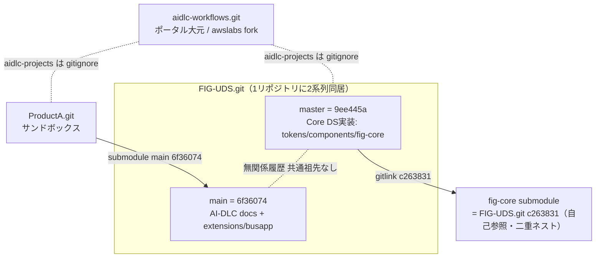
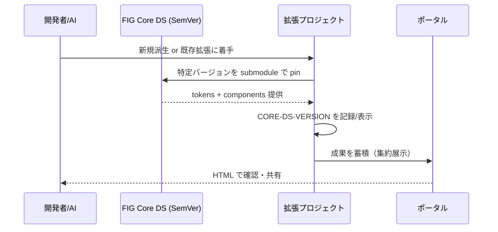

# System Architecture

> Reverse Engineering 成果物 — 既存のリポジトリ/ブランチ構造と設計の現状

## System Overview
FIG デザインシステムは「三層アーキテクチャ（Primitive → Semantic → Component）」を中核思想に持つが、**現状の git 構造はこの思想と一致しておらず、資産が複数ブランチ/サブモジュールに散在**している。Inception の主目的はこの構造を循環モデルに沿って再編すること。

## Architecture Diagram（現状 / as-is）

## Component Descriptions

### FIG-UDS.git / master(9ee445a)
- **Purpose**: FIG Core DS の実装本体
- **Responsibilities**: `primitives.css` / `semantic.css`、`components/`（spec 10件）、`tokens/`、`patterns/`、`storybook/`、`preview/`、`fig-core`(submodule)
- **Dependencies**: 自己参照 submodule fig-core(c263831)
- **Type**: Design System Core

### FIG-UDS.git / main(6f36074)
- **Purpose**: AI-DLC inception 成果＋拡張 busapp 実装
- **Responsibilities**: `aidlc-docs/`、`existing-code/`（component spec 約28種の網羅カタログ）、`extensions/busapp/`（実装 JSX 4 + tokens）
- **Dependencies**: なし（master と無関係履歴）
- **Type**: Mixed（docs + extension）

### aidlc-workflows.git（ポータル大元）
- **Purpose**: ポータル兼 AI-DLC 基盤
- **Responsibilities**: 集約展示、HTML確認、GitHub共有
- **Dependencies**: `aidlc-projects/*` は gitignore（各々独立 repo）
- **Type**: Portal / Framework

### ProductA.git
- **Purpose**: submodule 引込みの検証サンドボックス
- **Dependencies**: `design-system` submodule → FIG-UDS.git main(6f36074)、`@design-system/extensions/busapp` を import
- **Type**: Sandbox（検証後削除）

## Data Flow（参照フロー / 目標 to-be）

## Integration Points
- **External APIs**: なし（N/A — フロントエンド資産中心）
- **Databases**: なし（N/A）
- **共有/配布**: GitHub（リポジトリ＋将来 GitHub Pages による HTML 共有）

## Infrastructure Components
- **配布機構**: git submodule（Core DS を各プロジェクトが参照）
- **デプロイモデル**: 静的 HTML（ポータル）＋ React ビルド（拡張プロジェクト, CRACO）
- **CI/CD**: 大元に各種セキュリティ/lint 設定あり（.bandit, .checkov, .gitleaks, markdownlint, pre-commit 等）。デザイン資産側の CI は未整備
