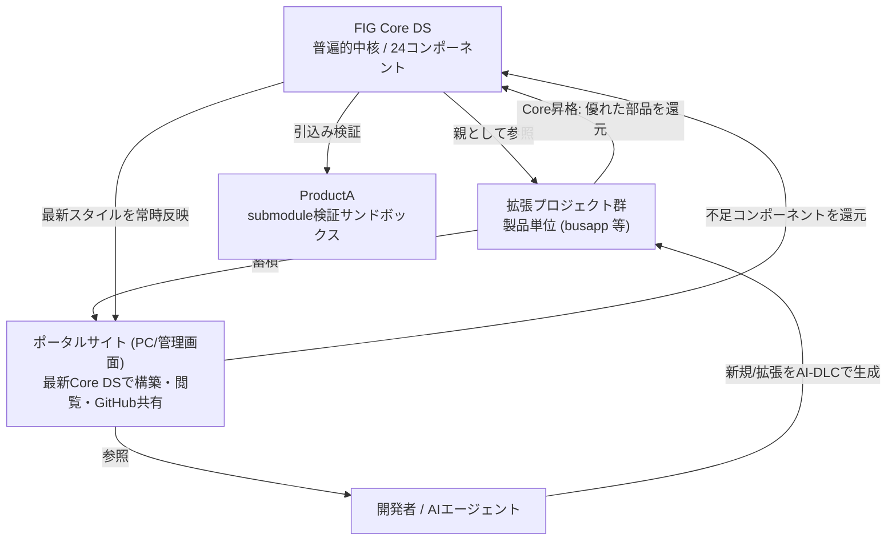

# Business Overview

> Reverse Engineering 成果物 — 既存資産の業務的全体像（design-system ドメインに適応）

## Business Context Diagram

## Business Description
- **Business Description**: FIG ブランドのデザイン資産を「中核(Core DS)」として一元管理し、各製品の UI を中核から派生・拡張させ、その成果をポータルに自社資源として蓄積する**循環型デザインシステム運用**。AI-DLC により新規立ち上げ・既存機能拡張を高速化する。
- **Business Transactions（＝デザイン運用トランザクション）**:
  1. **Core DS ブラッシュアップ**: 中核コンポーネント/トークンの追加・大幅修正（バージョン更新を伴う）
  2. **新規プロジェクト派生**: Core DS を親に新製品の拡張 DS を立ち上げ（template を雛形に複製）
  3. **既存プロジェクト取り込み**: Core DS 導入前の既存製品を拡張プロジェクト枠へ格納・段階移行
  4. **既存プロジェクト拡張**: 既存拡張製品の機能追加/ブラッシュアップ（Core DS + 当該製品のみ参照）
  5. **バージョン参照確認**: 各プロジェクトが参照する Core DS バージョンを記録・表示
  6. **ポータル蓄積/閲覧**: Core DS + 拡張群を HTML で確認（①コンポーネント単体、②**プロジェクトのページ遷移**＝画面間ナビゲーション、③**デモ画面**＝製品の実画面プレビュー）、GitHub で共有
  7. **ポータル自体のドッグフーディング/循環**: ポータル（PC/管理画面）を**常に最新 Core DS のスタイルで構築**。構築過程で不足コンポーネントが判明した場合は**最新 Core DS に追加**し、ポータルも自社資源として循環に組み込む
  8. **Core 昇格（promotion）**: 特定プロジェクト開発でより優れたコンポーネントが生まれた場合、普遍化して Core DS に昇格させる。**既存 FIG Core DS の Contribution ガイドに準拠**（3プロダクト基準・昇格チェックリスト・次MINORで公開）。※ポータルでは**「運用」カテゴリ**に配置（開発作業ではなくシステム運用/ガバナンス）
  9. **操作随伴ガイド（使い方ページ）**: AI-DLC 開発に限らず、**ユーザに操作を依頼する全場面（運用＝Core昇格等を含む）に詳細な使い方ページを必ず付随**。**口頭説明なしに、使い方ページをベースとして、各チーム標準の Git ツールや AI アシスタントの支援のもとで、誰でも等しく再現可能な精度**を目標
- **Business Dictionary**:
  - **FIG Core DS**: FIG ブランドの普遍的中核デザインシステム（24コンポーネント想定）。全拡張の親。現 `master`(9ee445a)。
  - **拡張プロジェクト**: Core DS を特定製品条件で拡張した派生（例: busapp）。製品単位で独立。
  - **三層アーキテクチャ**: Primitive → Semantic → Component の依存方向（上位は下位のみ参照）。
  - **スコープ分離**: 開発/AI生成時に Core DS + 当該製品のみを可視化し、無関係製品を遮断する原則。
  - **サンドボックス(ProductA)**: submodule 引込みの動作検証用・使い捨て環境。
  - **デバイス最適化（device-variant / プロファイル）**: Core DS は表示デバイスごとにコンポーネントを最適化する設計意図を予め持つ。対象は**3プロファイル**（CSS の `.fig-profile-*` クラスで切替）：
    - **Web-Admin**（PCメイン・情報密度優先）
    - **Mobile-Consumer**（一般ユーザー向けスマホ・操作性優先）
    - **Mobile-Terminal**（業務用端末・固定視認性）
    - → ポータルは **Web-Admin** を主対象とする。
  - **プロジェクト分類階層（taxonomy）**: ポータル上の各プロジェクトは**多階層カテゴリ**で整理する ── **カテゴリ > サブカテゴリ（関連システム/製品ライン）> プロジェクト**。今後さらに細分化可能。
    - カテゴリ例: バス / タクシー / 物流 …
    - 例1: バス > バスロケーションシステム > [プロジェクト1]
    - 例2: 物流 > iMESH > [プロジェクトA]
    - この階層はサイドメニュー構造に直結し、スコープ分離（カテゴリ単位の独立 repo/参照）の基盤にもなる
  - **Core 昇格フロー（promotion）**: 拡張プロジェクト/ポータルで生まれた優れた部品・パターンを Core DS へ採用する経路。**ポータルでは「運用」カテゴリに属するガバナンスフロー**（開発作業ではない）。**既存 FIG Core DS に詳細記載あり**（master: `assets/js/portal-content.js` の Contribution ページ）。要点：
    - ① 提案（GitHub Issue ＋ `core-promotion` ラベル、利用文脈を3行で）
    - ② 3プロダクト基準（異なる3製品以上の利用実績、または明示需要）
    - ③ 普遍化（ドメイン固有語彙を除去し、Core DS のトークン階層に準拠した Device Profile 非依存のコンポーネントへ書き直し）
    - ④ レビュー（Core Maintainer 1名 ＋ 関連 Extensions Lead 2名以上）
    - ⑤ リリース（Core の次 **MINOR** バージョン v1.x+1 に収録）
    - 昇格判定チェック例：3プロファイル成立 / Core トークン階層の遵守（Primitive/Semantic の直接ハードコード禁止） / `--fig-*` トークン経由実装 / WCAG AA / reduced-motion 追従 / spec・preview 完備
    - **運用上の懸念と対策は別節「Core 昇格フロー — 運用設計上の配慮」を参照**
  - **操作随伴ガイド原則（self-contained how-to）**: ユーザに操作を依頼する**すべての場面**（AI-DLC 利用、Core昇格などの運用操作を含む）に、口頭説明なしで再現可能な**詳細な使い方ページを必ず付随**させる。
  - **情報設計思想（玄人最適化 / 情報密度優先）**: 運用が進むと利用者の多くが玄人化する前提で、メイン画面は**最重要情報を最小クリック・ノンスクロール（一面完結）**で確認できる構成とする。詳細な使い方は**別ページへ遷移**させ、メインの一覧性・速度を損なわない（Web-Admin プロファイルの情報密度優先と整合）。
  - **常時最新反映（rolling）**: ポータルは Core DS の最新を**常に反映**（バージョン pin しない）。一方、拡張プロジェクトは特定バージョンを **pin**（再現性・参照バージョン確認のため）。この差異が両者の本質的な違い。

## Component Level Business Descriptions

### FIG Core DS（中核 / master 9ee445a）
- **Purpose**: FIG ブランドの一貫した視覚言語とコンポーネント群を提供する唯一の正典
- **Responsibilities**: トークン定義（primitives/semantic）、コンポーネント仕様、バージョン管理の起点

### 拡張プロジェクト busapp（main 6f36074 / extensions/busapp）
- **Purpose**: 公共交通バスアプリ向けに Core DS を具体化した第1号の拡張プロジェクト（実製品）
- **Responsibilities**: 製品固有のコンポーネント実装（Card/Button/FAB/TextField）
- **Note**: 新規派生の「雛形」は busapp ではなく、汎用 `template` が担う（要件で正式定義）

### ポータル（aidlc-workflows 大元）
- **Purpose**: Core DS と拡張群を集約し、視覚確認・共有する場。**自身のスタイルも常に最新 FIG Core DS を反映する PC 向け管理画面**であり、循環の一構成要素（自社資源）
- **Responsibilities**: HTML プレビュー（コンポーネント単体／プロジェクトのページ遷移／デモ画面）、GitHub 共有、AI-DLC 基盤、**最新 Core DS スタイルの常時適用（PC/管理画面）**、**構築過程で判明した不足コンポーネントの Core DS への還元**
- **Device**: **Web-Admin**（PCメイン・情報密度優先）。Core DS の3デバイスプロファイル（Web-Admin / Mobile-Consumer / Mobile-Terminal）設計に基づく
- **Reference**: https://cloudscape.design/ のような**堅牢な構成**をイメージ（左サイドナビ中心の管理画面）
- **Navigation**: **サイドメニューから目的プロジェクトへ即時到達**することが必須。プロジェクトは**カテゴリ階層**で整理（後述 taxonomy）し、今後さらに細分化可能とする
- **Structure（サイドメニュー上位構成 / 3区分）**:
    1. **概要** — 本システム（ポータル）の全体像・設計思想・はじめに
    2. **プロジェクト集** — taxonomy（カテゴリ＞サブカテゴリ＞プロジェクト）で、コンポーネント／ページ遷移／デモ画面を閲覧
    3. **運用** — Core昇格フロー、Contribution / PR 作法、バージョン管理等の**ガバナンス**（＝資源/システムを運用するためのカテゴリ。開発ツールではない）
- **Usage Guide（操作随伴ガイド）**: AI-DLC 開発に限らず、**操作を依頼する全場面（運用含む）に詳細な使い方ページを必ず付随**。**口頭説明なしに、使い方ページをベースとして、各チーム標準の Git ツールや AI アシスタントの支援のもとで、誰でも等しく再現できる精度**（self-contained runbook）
- **Information Design（玄人最適化）**: メイン画面は**最重要情報を最小クリック・ノンスクロール（一面完結）**で。詳細な使い方は**別ページ遷移**でメインの一覧性・速度を維持（Web-Admin 情報密度優先と整合）

### ProductA（サンドボックス）
- **Purpose**: Core DS を submodule で正しく引けるかの運用検証
- **Responsibilities**: 検証完了後に役割を終え削除

## Core 昇格フロー — 運用設計上の配慮

既存の5ステップフローを「現場が回し続けられる」ものにするための配慮。★印は Requirements で選択肢を最終確定する。

### 1. 提案のハードルを下げる（オンボーディングの壁の解消）
- **①提案** は「3行の文脈＋アイデア」だけで起票可能とし、普遍化・a11y 対応を**提案者に課さない**。
- **③普遍化・④レビュー** の段階で **Core Maintainer が伴走・サポート**し、普遍化・アクセシビリティ対応を共同で完了させる。
- 役割分担: 提案者＝課題と利用文脈の提示 ／ Core Maintainer＝普遍化・トークン整合・a11y の仕上げ。

### 2. 車輪の再発明の防止（横展開の可視化 / ショーケース）
- ポータル「プロジェクト集」内に **Core 未満の「各拡張プロジェクト独自パーツ一覧」ショーケース**を設置。
- 独自パーツ一覧（または GitHub Issue リンク）を**常時最新で可視化**し、他プロジェクトが発見・再利用・昇格提案できるようにする。
- これにより「3プロダクト基準」到達前の重複開発（車輪の再発明）を抑制。

### 3. レビュー負荷の集中緩和（リリースベロシティの確保）★
- 「Core Maintainer 1名＋Extensions Lead 2名以上」がボトルネック化しないための緩和策（要確定）:
  - **二段レビュー**: 軽微＝Maintainer 1名で承認 ／ Core API・トークン破壊的＝フルレビュー
  - **リリース列車（release train）**: MINOR を一定周期にまとめ、承認待ち滞留を解消
  - **非同期レビュー**: チェックリスト自動判定＋スクショ添付で同期会議を不要化

### 4. rolling のリグレッション対策（ポータル表示崩れ防止）★
- ポータルは Core を pin しない（rolling）ため、Core の MINOR/PATCH がポータル表示へ波及するリスクがある。
- **Core DS 側 CI/CD に、ポータルを巻き込んだ Visual Regression Test (VRT) ＋自動ビルドチェック**を組み込む。
- Core 変更 PR は **VRT グリーンをマージ条件**とし、崩れを事前検知（保留事項「HTML差分可視化」と連動）。

### 5. 普遍化に伴う元プロジェクトのマイグレーション方針★
- ③で普遍化（ドメイン語彙除去・Profile 非依存化）された際の、元プロジェクトの追従コストの所在を明確化:
  - 既定方針＝**後方互換優先**。Core 側で旧名→新名の**エイリアス/ラッパー**を一定期間提供し、元プロジェクトは段階移行。
  - 破壊的変更時は **MAJOR**＋移行ガイド（既存 Contribution の PR 作法に準拠）。
  - マイグレーション主体の原則（Core Maintainer がラッパー提供 ／ 元プロジェクトが期限内に追従）を要確定。
