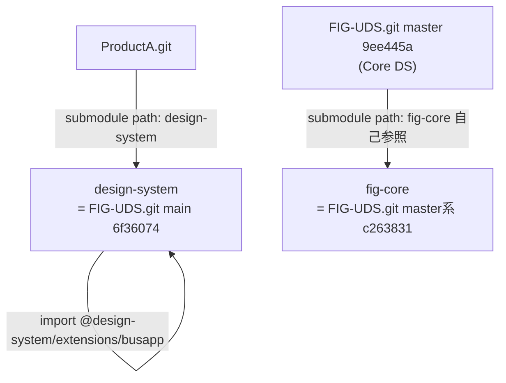

# Dependencies

> Reverse Engineering 成果物 — リポジトリ間/サブモジュール依存の現状

## Internal Dependencies（submodule 関係）

### ProductA → FIG-UDS.git (main 6f36074)
- **Type**: git submodule（path: `design-system`）
- **Reason**: 拡張 busapp の components/tokens を `@design-system/extensions/busapp` として参照

### FIG-UDS.git master → FIG-UDS.git (c263831) 自己参照
- **Type**: git submodule（path: `fig-core`）
- **Reason**: 二重ネストの原因。master が自リポジトリの旧コミットを submodule 化している（**要解消**の技術的負債）

## External Dependencies
### React
- **Version**: ProductA package.json 準拠（CRA系）
- **Purpose**: コンポーネント実装/レンダリング
- **License**: MIT

### CRACO
- **Purpose**: CRA ビルド設定の上書き（エイリアス・スコープ解除）
- **License**: MIT

## ⚠️ 依存上の問題点（要再設計）
1. **バージョン pin が未確立**: submodule はコミットハッシュ依存で、SemVer タグによる「参照バージョンの可読な確認」が不在
2. **自己参照 submodule（fig-core）**: master が自身を submodule 化し二重ネストを生む
3. **2系列同居**: main / master が無関係履歴で同一リポジトリに同居し、参照先が混乱
4. **スコープ分離の欠如**: 製品単位の独立 repo 化が未完で、無関係資産を遮断できない
